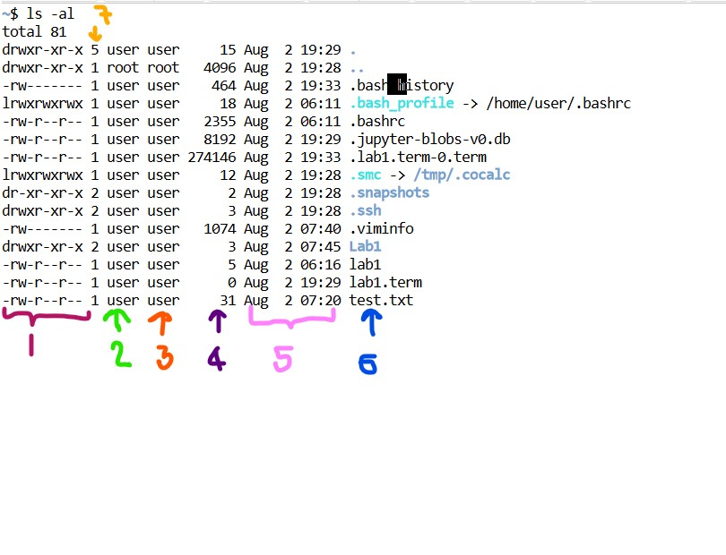

# Basic Linux Command 

| Command | Output |
|------- | --- |
| pwd | Gives absolute path to our working | 
| whoami | Gives the name of the working user (hosts' name) |
| who | To get the information about logged in users |
| ls | List down the content of current working directory without indetails|
| ls -al| List down all the content of the current working directory including hidden files |
| ls -a | List down all the hidden file without indetails |
| ls -l | List down all the content of files with details including hidden files |
| cd .. | Move to parent directory |
| cd (name of the directory) | Move to one directory forward |
| vi (nameOfThe Directory) | Create files |
| :wq! | save and exit from the file |
| cat (nameOfThe Directory) | Creat file |
| mkdir (nameOfThe Directory) | Create Directory|
| rmdir | (nameOfThe Directory) | Delete Directory|
| cp (nameOfTheSourceFile) (nameOfTheNewFile) | Copy content to another file |
| mv (nameOfTheSourceFile) (nameOfTheNewFile) | Move content to another file |
| mv (nameOfTheSourceFile) ./  (nameOfTheDirecorty) | Move content to another directory |
| head -3 (nameOfTheFile) | Displays first 3 digits in file |
| tail -5 (nameOfTheFile) | Displays last 5 digits in file |

 
 

## File Details

 

| Number | Indications |
|------- | --- |
| 1 | File access permisions |
| 2 | User name |
| 3 | root name |
| 4 | Ouput block size |
| 5 | Date and time that file was modified |
| 6| File name |
| 7 | No of links that related to the file |

