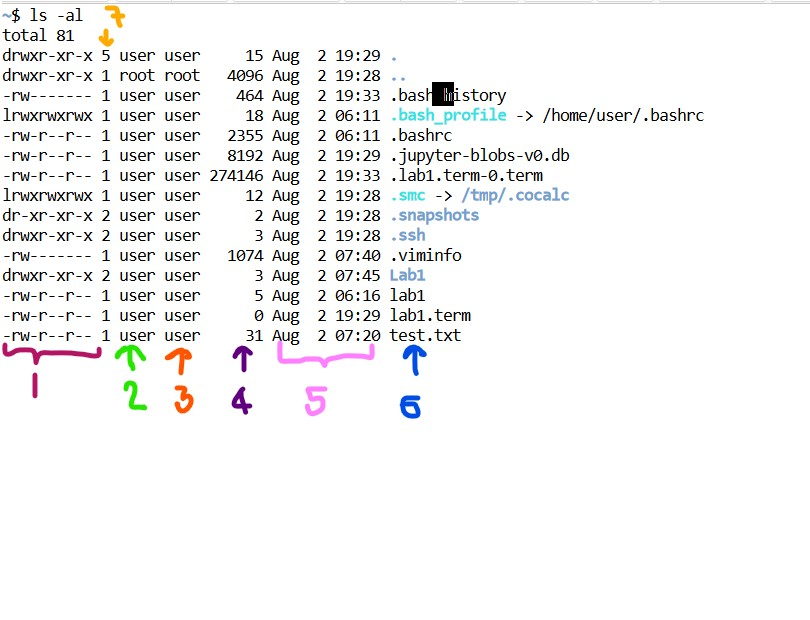
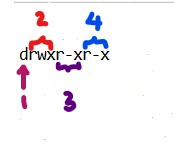
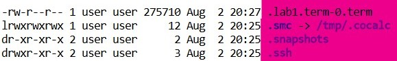

# Basic Linux Command 

| Command | Output |
|------- | --- |
| pwd | Gives absolute path to our working | 
| whoami | Gives the name of the working user (hosts' name) |
| who | To get the information about logged in users |
| ls | List down the content of current working directory without indetails|
| ls -al| List down all the content of the current working directory including hidden files |
| ls -a | List down all the hidden file without indetails |
| ls -l | List down all the content of files with details |
| cd .. | Move to parent directory |
| cd **(name of the directory)** | Move to one directory forward |
| vi **(nameOfTheDirectory)** | Create files |
| :wq! | save and exit from the file |
| cat **(nameOfTheDirectory)** | Creat file |
| mkdir **(nameOfTheDirectory)** | Create Directory|
| rmdir | **(nameOfThe Directory)** | Delete Directory|
| cp **(nameOfTheSourceFile) (nameOfTheNewFile)** | Copy content to another file |
| mv **(nameOfTheSourceFile) (nameOfTheNewFile)** | Move content to another file |
| mv **(nameOfTheSourceFile)** ./  **(nameOfTheDirecorty)** | Move content to another directory |
| head -3 **(nameOfTheFile)** | Displays first 3 digits in file |
| tail -5 **(nameOfTheFile)** | Displays last 5 digits in file |

 
 

## File Details

 

| Number | Indications |
|------- | --- |
| 1 |File type and File access permissions |
| 2 | User name |
| 3 | Root name |
| 4 | Ouput block size |
| 5 | Date and time that file was modified |
| 6| File name |
| 7 | No. of links that related to the file |

  

## 1 - File Typa and File Access Permissions

 

| Number | Indications |
|------- | --- |
| 1 | **d** --> Directory   **s** --> Soccut File   **-** --> Regular File   **b** --> Block Special File   **c** --> Character Special File   **l** --> link file or Symbolic File|
| 2 | This first 3 is for the **user**  |
| 3 | Second 3 is for the **group** |
| 4 | Last 3 for the the **other users**|

**In unix system or linux working system there are 3 type of file access permissions**

1. r --> read permission  
2. w --> write permission  
3. x --> execute permission  
   
 

**File Access permission related to 3 users** 
 
1. User  
2. Group  
3. Other Users  

   

## 6 - File Name - Hidden FIles

  

 

* Before the file name if we can find the a dot operator **( . )**, it means that file is a hidden file.

