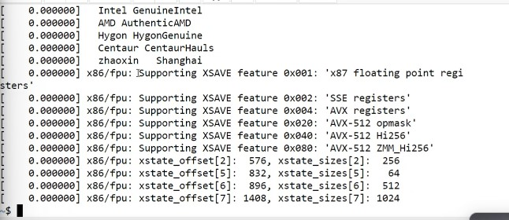

## Labsheet 02 - linux commands 

| Command | Output |
|------- | --- |
| echo | Type anything in the terminal and print it |
| man **linux commands** | See the manual page of the particular page |
| passwd | Change the users password |
| date | Display the date and time |
| hostname | Gives the host name |
| arch | Gives machine architecture (it's means give the machine hardware name) |
| uname -a | Prints the system information |
| dmesg | Display the kernal ring buffer |

 

## **dmesg Command*** 

 

* In the most unix or the linux OS we can see some kind of a buffer message print in the terminal once type this command 

 

* We can get how long the system has been running in the terminal
